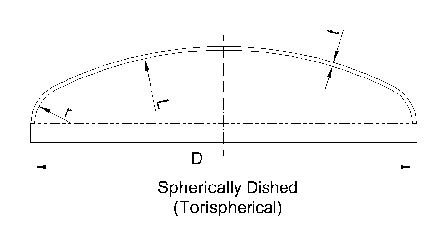

#+TITLE: 碟形端板厚度計算 (ASME Sec. VIII Div.1)
#+AUTHOR: Each Application Mechanical Design Studio (各申機械設計工作室)
#+DATE: 2026-04-10

#+OPTIONS: toc:nil num:nil tex:mathjax
#+REVEAL_THEME: league
#+REVEAL_TRANS: slide
#+REVEAL_INIT_OPTIONS: width:1920, height:1080, transition:'slide', controls:true, progress:true, margin:0.1
#+REVEAL_HEAD_PREAMBLE: 

* 專案簡介
本文件採用 **Docs-as-Code** 工作流，確保工程計算與技術文件的一致性。
- *單位系統*：**SI (Metric) 國際標準公制單位**
  - 壓力 (P): $MPa$
  - 長度/厚度 (L, r, Di, t): $mm$
  - 應力 (S): $MPa$
- *法規依據*：ASME BPVC Section VIII Division 1 (2025 Edition)
- *適用範圍*：內壓環境下之碟形封頭設計 (Torispherical Head)

* 免責宣告 (Disclaimer)
#+REVEAL_HTML: 

**注意：本文件非正式法規認證文件**
1. **適用條件限制**：本計算僅適用於均勻厚度且無局部應力集中之碟形封頭。
2. **適任性要求**：根據 **ASME 2025 Appendix 47**，設計人員必須經過製造廠之適任性評估。本腳本僅供輔助，不替代工程判斷。
3. **專業審核**：實際應用必須由具備資格之 **專業工程師 (PE)** 最終審核、簽署並蓋章。
#+REVEAL_HTML: 

* 設計參數輸入
#+ATTR_HTML: :width 450px :alt "Torispherical-drawing"

#+NAME: design_params
| 參數名稱     | 符號 | 數值 | 單位 |
|--------------+------+------+------|
| 設計壓力     | P    |  1.6 | MPa  |
| 內徑         | Di   | 1200 | mm   |
| 冠部內半徑   | L    | 1200 | mm   |
| 轉角內半徑   | r    | 72   | mm   |
| 材料許用應力 | S    | 138  | MPa  |
| 焊道效率     | E    | 0.85 | N/A  |
| 公稱厚度     | tn   | 16.0 | mm   |
| 腐蝕裕度     | CA   | 2.0  | mm   |

* 幾何係數 M 的計算
** 公式與幾何關係
#+REVEAL_HTML: 

#+REVEAL_HTML: 

根據 ASME BPVC Section VIII, Division 1, Mandatory Appendix 1-4，幾何係數 $M$ 的計算公式如下：

$$ M = \frac{1}{4} \left( 3 + \sqrt{\frac{L}{r}} \right) $$

其中：
- *L* ：封頭冠部內半徑 (Inside Dish Radius)
- *r* ：封頭邊緣轉角內半徑 (Inside Knuckle Radius)
#+REVEAL_HTML: 

#+REVEAL_HTML: 

#+ATTR_HTML: :width 450px :alt "Torispherical-drawing"

#+REVEAL_HTML: 

#+REVEAL_HTML: 

** 計算結果與代入
#+NAME: calc_m
#+BEGIN_SRC maxima :var params=design_params :exports results :results output html :eval yes
  load("stringproc")$
  linel: 1000$

  /* 強化版參數提取函數：確保參數存在，否則中斷編譯 */
  find_val(target, tbl) := block([val: false], 
    for row in tbl do (if ssubst("", " ", string(row[2])) = target then val: row[3]), 
    if val = false then error(sconcat("Critical Error: Parameter not found - ", target)) else val
  )$

  L_v : float(find_val("L", params))$
  r_v : float(find_val("r", params))$
  M_v : 0.25 * (3 + sqrt(L_v/r_v))$

  printf(true, "
")$
  printf(true, "
")$
  printf(true, "M = 0.25 * (3 + sqrt(~,1f / ~,1f)) ", L_v, r_v)$
  printf(true, "
")$
  printf(true, "應力集中係數 <strong>M = ~,4f</strong>
", M_v)$
#+END_SRC

#+RESULTS: calc_m
#+begin_export html

M = 0.25 * (3 + sqrt(1200.0 / 72.0)) 
應力集中係數 <strong>M = 1.7706</strong>

#+end_export

* 需求厚度與強度評估
** 強度計算公式
根據 ASME 規範，最小需求厚度 $t$ 計算如下：

$$ t = \frac{P \cdot L \cdot M}{2SE - 0.2P} $$

** 強度評估結果
#+NAME: design_check
#+BEGIN_SRC maxima :var params=design_params :exports results :results output html :eval yes
linel: 1000$
load("stringproc")$
find_val(target, tbl) := block([val: false], 
  for row in tbl do (if ssubst("", " ", string(row[2])) = target then val: row[3]), 
  if val = false then error(sconcat("Critical Error: Parameter not found - ", target)) else val
)$

P : float(find_val("P", params))$
L : float(find_val("L", params))$
r : float(find_val("r", params))$
S : float(find_val("S", params))$
E : float(find_val("E", params))$
tn : float(find_val("tn", params))$
CA : float(find_val("CA", params))$

M_v : 0.25 * (3 + sqrt(L/r))$
t_req : (P * L * M_v) / (2*S*E - 0.2*P)$
t_available : tn - CA$

/* 市售板厚建議邏輯 */
t_min_threshold : t_req + CA$
spec_plates : [6, 8, 10, 12, 14, 16, 18, 20, 22, 25, 28, 30, 32, 36, 38, 40]$
recommended_val : 0$
for p in spec_plates do (if p >= t_min_threshold then (recommended_val : p, return(p)))$

is_pass : if t_available >= t_req then true else false$
color : if is_pass then "#4CAF50" else "#f44336"$

printf(true, "
", color)$
printf(true, "<strong style=\"color:~a; font-size: 1.2em;\">[ ~a ]</strong>  ", 
       color, if is_pass then "PASS 符合規範：可進入製造設計階段" else "FAIL 厚度不足：需重新評估設計")$

/* 數值代入展示區 */
printf(true, "
")$
printf(true, "代入計算過程 (SI Units)： ")$
printf(true, "t = (~,1f * ~,1f * ~,4f) / (2 * ~,1f * ~,2f - 0.2 * ~,1f) ", P, L, M_v, S, E, P)$
printf(true, "t_req = <strong>~,3f</strong> mm", t_req)$
printf(true, "
")$

printf(true, "● 最小需求厚度 (t_req)：<strong>~,3f</strong> mm ", t_req)$
printf(true, "● 建議公稱厚度 (t_req + CA)：<strong>~a</strong> ", 
       if recommended_val > 0 then sconcat(string(recommended_val), " mm") else "超出常用板厚範圍 (需客製或改設計)")$
printf(true, "
")$
printf(true, "● 現有有效厚度 (tn - CA)：<strong>~,1f - ~,1f = ~,1f</strong> mm ", tn, CA, t_available)$

if is_pass then 
   printf(true, "評估結果：<strong>~,1f >= ~,3f</strong> (符合強度要求)", t_available, t_req)
else 
   printf(true, "⚠️ 警告：有效厚度 ~,1f 小於需求厚度 ~,3f", t_available, t_req)$
printf(true, "
")$
#+END_SRC

#+RESULTS: design_check
#+begin_export html

<strong style="color:#f44336; font-size: 1.2em;">[ FAIL 厚度不足：需重新評估設計 ]</strong>  
代入計算過程 (SI Units)： t = (1.6 * 1200.0 * 1.7706) / (2 * 138.0 * 0.85 - 0.2 * 1.6) t_req = <strong>14.511</strong> mm
● 最小需求厚度 (t_req)：<strong>14.511</strong> mm ● 建議公稱厚度 (t_req + CA)：<strong>18 mm</strong> 
● 現有有效厚度 (tn - CA)：<strong>16.0 - 2.0 = 14.0</strong> mm ⚠️ 警告：有效厚度 14.0 小於需求厚度 14.511

#+end_export

* 結論與工程判斷
- **自動化校核**：透過 Maxima 引擎排除人為錯誤，確保計算路徑 Audit-ready。
- **適任性管理**：本計算書由適任設計人員生成，符合 2025 Appendix 47 之工程管理精神。
- **資料追溯**：本文件原始碼受版本控制系統保護，確保工程判斷邏輯之可追溯性。

* 最後編譯時間
#+BEGIN_SRC emacs-lisp :exports results :results html
  (format "
技術審核時間：%s (UTC+8)
" (current-time-string))
#+END_SRC

#+RESULTS:
#+begin_export html

技術審核時間：Fri Apr 10 08:51:38 2026 (UTC+8)

#+end_export
